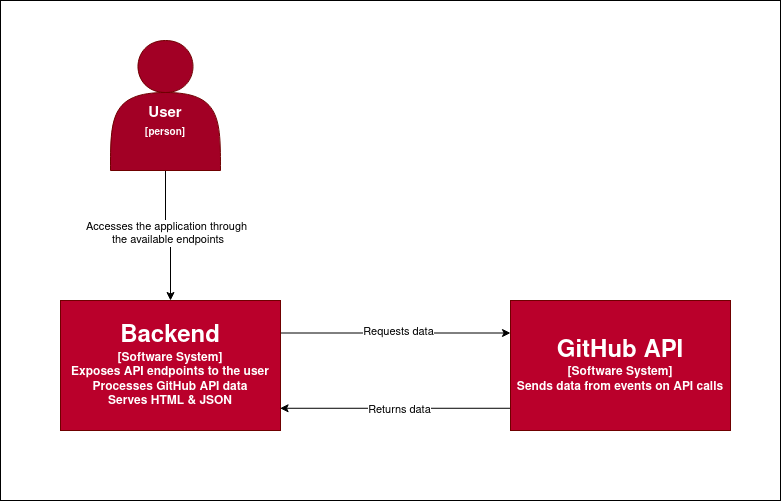

# GitHub Event Monitor

This project monitors events happening on GitHub using the GitHub API. It streams specific events from the API and provides metrics at any time via a REST API to the end user.

## Requirements

    - Python 3.x
    - Flask
    - Requests

## Installation

1. Clone the repository:

    git clone https://github.com/davidmeijide/github-monitor.git
    cd github-monitor

2. Install the dependencies:

    pip install -r requirements.txt

3. Configuration

    Obtain a personal access token from GitHub API. You can follow the steps in GitHub's documentation to create a token.
    Create a .env file in the root directory of the project and set the token as an environment variable:

## Usage

Run the Flask application: 

    flask --app main run

Access the endpoints at http://localhost:5000.

## Endpoints

### GET /events/total/<int:offset>

Returns the total number of events grouped by the event type for the specified offset (in minutes).

Parameters:

    offset: (required) The number of minutes to look back to count the events.

### GET /repositories/<owner>/<repo>/avg/pulls

Calculates the average time between pull requests for the specified repository.

Parameters:

    owner: (required) The username or organization that owns the repository.
    repo: (required) The name of the repository.